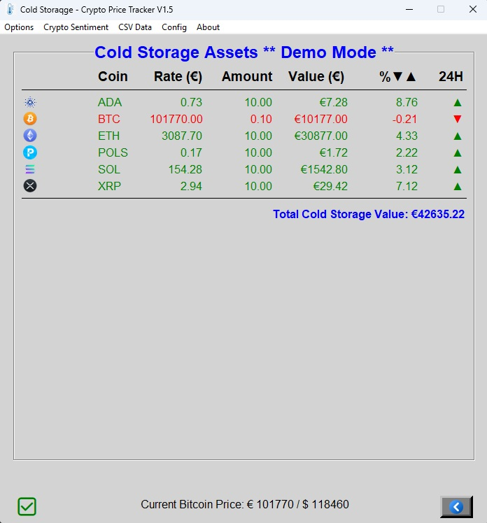
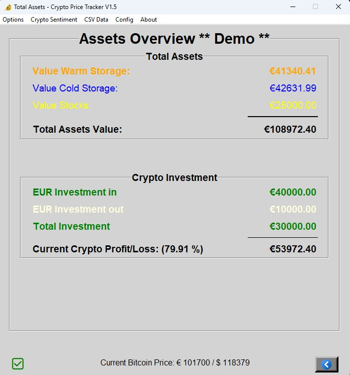

# Crypto Price Tracker V1.5 (2025)


This tracker keeps track of crypto coins in your possession. It provides an overview of:

- **Warm storage**: Coins and value on the exchange  
- **Cold storage**: Coins and value in hardware wallets  
- **Stocks**: (Currently under development)
- **Total Assets**: (Cold, Warm, Stocks and specific profit loss if csv has been loaded)


It reads CSV files from your exchange and provides summaries and pivot tables in `tracker.xlsx`.

You can adjust refresh rates, enable Excel writing, and view optional live view websites via the **Parameters** screen.

---

## 📌 Introduction

Tracker was born out of frustration—too many screens to monitor my crypto holdings, stock values, and average purchase prices. Maintaining a spreadsheet manually took too much effort.

Instead of opting for an integrated solution, I chose to experiment with AI tools like **Copilot, Claude, Gemini, DeepSeek**, and **ChatGPT**. The journey was full of trial and error—especially the Crypto Fear and Greed Index, where pointer directions and color logic took many iterations to get right.

Starting from basic Python knowledge, this project deepened my understanding of Python and AI. It’s still a work in progress—and a fun one at that.

---

## 🛠️ Setting Up

You can run the program in a Python environment or build a Windows executable using [auto-py-to-exe](https://github.com/brentvollebregt/auto-py-to-exe).

### Required files and structure:

```
tracker.py  
tracker.cfg  
config_tracker_module.py  
calcpiv_module.py  
show_readme_module.py  
fng_module.py
crypto_ticker_module.py
/crypto/
/screens
```

### pip install:
Install in the python environment the following

```
pip install pillow
pip install requests
pip install beautifulsoup4
pip install pywebview
pip install markdown
pip install matplotlib
pip install pywin32

or copy the above in requirements.txt
and on the command line use
pip install -r requirements.txt


```
### Open Excel file tracker.xls

```
Navigate tot Credentials worksheet
  - Fill in the name of the exchange (Bitvavo)
  - API Key,
  - Secret Key
  - URL (https://api.bitvavo.com/v2/)

Navigate to Cold_Storage worksheet
  - Fill in the short name of the Coin(s) and the Amount in cold_storage
Save the excel files
Start tracker (e.g. python3 tracker.py)
```


## 📂 File Descriptions

### `tracker.py`
Main program. Checks for `tracker.xlsx`, creates it if not found.  
**Credentials** sheet: add API keys from your exchange (read only !).  
**Cold_Storage** sheet: enter coin name and amount (value is fetched live).  

### `tracker.cfg`
Auto-generated config file with default settings:

```
==RefreshRate==
main = 30
warm = 15
cold = 15
total = 15

[WriteData]
warm = True
cold = False
total = True
csv = True

[OptionalURL]
url1 = https://cointelegraph.com/
name1 = Cointelegraph
url2 = https://www.coindesk.com/
name2 = Coindesk
url3 = https://coinmarketcap.com/sentiment/
name3 = Coinmarket Sentiment

[Miscellaneous]
debugmode = False
darkmod = False
demomode = False
cold storage available = True
```

### config_tracker_module.py
Handles screen refresh rates and Excel writing.  
Note:  
- Setting the main screen refresh below 15s may result in **CoinGecko** rejecting requests.  
-  **dark mode** , **debug mode*** and **demo mode** toggles are currently functional.  

### calcpiv_module.py`
Processes your exchange CSV file.  
If enabled in config, it writes:
- Summary → `CSV_History`  
- Raw data → `Raw Data`  
- Pivot tables → `Pivot Table Summary` and `Pivot Table Detail`

### 'fng_module.py' icluded 'crypto_ticker_module'
Show the current Fear and Greed index. Projects the top 10 Gainers and top 10 Losers. Wil show on the bottom line a crypto ticker with the 20 biggest according to marketcap

### `show_readme_module.py`
Displays this README from within the program.

### `/crypto/` directory
Contains screen and crypto icons in `crypto/ico/32/`.  
Missing icons have been auto-created. You may customize them.

### `/screens/` directory with screen images from the demo mode

---

## 🧭 Menu Options Overview

### 🏠 Main Screen
- Always starts with **Bitcoin**
- Dropdown: choose other coins
- Bottom-right: exchange rate (EUR/USD)
- Bottom-left: all-time high of selected coin

---

### 🔥 Warm Storage
View coins stored on your exchange.

### 🧊 Cold Storage
Manually enter your cold storage holdings in `Cold_Storage` worksheet. Values are fetched live using your exchange credentials.

### 📈 Input Stocks
Currently, only manual input of total stock value.  
Future version will include API integration.

---

### 🌐 Crypto Sentiment

- **Fear and Greed**: current crypto Fear and Greed index  
                      including top 10 Gainers & Losers

- **AGGR View**: live Bitcoin trading  
- **User-defined Crypto Sentiments**:
  - Default 1: [Cointelegraph](https://cointelegraph.com)
  - Default 2: [Coindesk](https://www.coindesk.com)
  - Default 3: [Coinmarket Sentiment](https://coinmarketcap.com/sentiment/)

---

### 📑 CSV Data

#### Load & Calculate
Loads and processes CSV from your exchange:
- Creates `CSV_History`, `Raw Data`, and pivot tables in `tracker.xlsx` (if enabled).

---

### ⚙️ Config - Parameters

- **Top left**: Set screen refresh rates  
- **Top right**: Enable writing data to Excel  
- **Bottom left**: Set URLs for live views  
- **Bottom right**: Toggle:
  - Debug mode
  - Dark mode
  - Demo Mode
  - Cold storage availability

---

### 🧾 Excel Control

- **Open Excel**: Opens `tracker.xlsx`  
- **Init Excel**: Creates a fresh `tracker.xlsx`  
  > Warning: All existing data will be lost!  
  > Refill `Credentials` to restart tracking

---

### ❓ About

You're reading it!

---

### Screens from the Demo Mode (Light mode and dark mode)

## Main


## Options








## Crypto Sentiment


## Config


## ✨ Latest Changes (10-07-2025)

➕New menu under options: Both Storage Assets. Shows Warm and Cold Storage combined

(09-07-2025)
➕Better design of the screens with use of grids, no more alignment
  issues. Shorter piece of code

(05-07-2025)
➕If on a windows platform the Load & Calculate will create real pivot   
  tables. Static pivot tables with other platforms. Total overhaul of
  this module. Includes: Average buy, Average Sell, Invested

➕README.md will now display icons in color. README will show examples of
  screens. Instead of doing the parsing of the text in-program it is now converted to html

➖Removed the in-program parser


## 💬 Contact

Use this program however you like—adjust, expand, break, or improve it.  
I'd love to hear about improvements or ideas!

📧 **gdgng01@gmail.com**

---

**Happy Tracking! 🚀**
